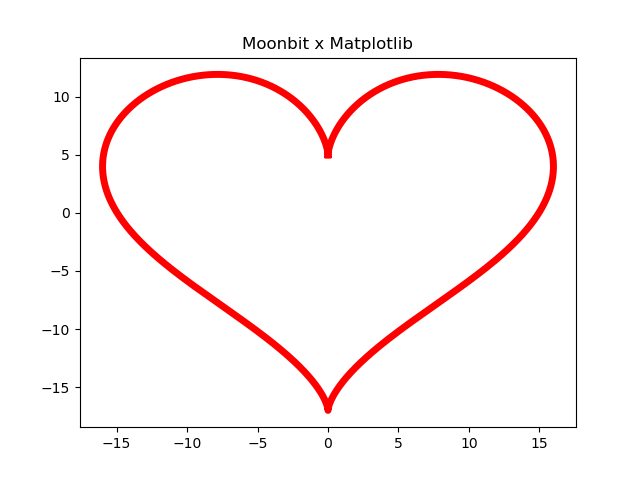

# ❤️ Matplotlib.mbt 🌙

[🇨🇳简体中文](#️-matplotlibmbt--1)

## ✨ Project Overview

`matplotlib.mbt` is an innovative tool built upon `python.mbt`, empowering developers to harness the capabilities of the powerful Python plotting library, Matplotlib, using the Moonbit language. By doing so, we can leverage Moonbit's robust type safety features and modern language ecosystem to bring a fresh perspective to data visualization.

## 🛠️ Environment Setup

Before diving into `matplotlib.mbt`, please ensure your development environment is properly configured.

### 🐍 Python Installation Guide

**Important Note**: This project requires Python 3.9 or higher. For the best experience, we strongly recommend using the latest stable version.

💡 Recommended: Use Anaconda: For data science and machine learning projects, we highly recommend installing Anaconda. Anaconda is a distribution of Python and conda package manager, which includes many commonly used data science libraries (such as NumPy, SciPy, Matplotlib, etc.), helping you manage Python environments and dependencies more easily.

**🐧 Linux (Debian/Ubuntu)**

If you are not using Anaconda, please ensure that Python 3.9 or higher and the Python development headers are installed on your system.

```bash
sudo apt-get update && sudo apt-get install python3.13 python3.13-dev
```

**🍎 macOS (Homebrew)**

```bash
brew install python@3.13
```

**🪟 Windows**

1.  Visit the [official Python website](https://www.python.org/downloads/windows/)
2.  Download the latest 3.x version installer
3.  During installation, make sure to check the "Add Python to PATH" option

### 📊 Matplotlib Installation

`matplotlib.mbt` relies on the Python Matplotlib library. You can install it using pip, Python's package installer.

If you **do not** have Anaconda installed, open your terminal or command prompt and run the following command:

Bash

```
pip install matplotlib
```

If you **have** installed Anaconda, Matplotlib is usually pre-installed. If it's not, you can install it using conda:

Bash

```
conda install matplotlib
```

### ✅ Environment Verification

Verifying your Python version and obtaining the Python development header file path are crucial for the subsequent configuration.

```bash
# Check Python version
python3 --version

# Get Python development header file path
python3-config --prefix
```

## ⚙️ Project Configuration

Follow these steps to configure your `matplotlib.mbt` project.

### 📦 Adding Dependencies

First, update your package index and install the core `python` library:

```bash
moon update
moon add Kaida-Amethyst/python
```

⚠️ **Please Note**: The current Moonbit package manager might have known issues with pure Native library support, and you might encounter related error messages. Please disregard these for now. The official Moonbit team is actively working on a fix. You can follow the progress on [Moonbitlang](https://www.moonbitlang.cn/).

### 🏗️ Build Configuration

Modify the `moon.pkg.json` file in your project's root directory by adding the following configuration:

```json
{
  "import": [
    {
      "path" : "Kaida-Amethyst/matplotlib",
      "alias" : "plt"
    }
  ],
  "link": {
    "native": {
      "cc": "$CC",
      "cc-flags": "$CC_FLAGS",
      "cc-link-flags": "$CC_LINK_FLAGS"
    }
  }
}
```

### ⚙️ Environment Variable Configuration

To enable Moonbit to interact correctly with Python, you need to configure some essential environment variables.

**🐧🍎 Linux/macOS** (`env.sh`):

```bash
#!/bin/bash
export PY_VERSION=$(python3 -c "import sys; print(f'{sys.version_info.major}.{sys.version_info.minor}')")
export CC=clang  # 🚀 We recommend using the clang compiler for better performance
export CC_FLAGS="-I$(python3-config --prefix)/include/python$PY_VERSION -O2 -DNDEBUG"
export CC_LINK_FLAGS="$(python3-config --ldflags) -lpython$PY_VERSION"
export C_INCLUDE_PATH="$(python3-config --prefix)/include/python$PY_VERSION:$C_INCLUDE_PATH"
```

Remember to execute this script in your shell:

```bash
source env.sh
```

**🪟 Windows PowerShell** (`env.ps1`):

```powershell
$PY_PATH = (python -c "import sys; print(sys.prefix)") | Out-String
$env:PY_VERSION = python -c "import sys; print(f'{sys.version_info.major}.{sys.version_info.minor}')"
$env:CC = "clang"
$env:CC_FLAGS = "-I$($PY_PATH.Trim())\include -O2 -DNDEBUG"
$env:CC_LINK_FLAGS = "-L$($PY_PATH.Trim())\libs -lpython$env:PY_VERSION"
```

Run this script in PowerShell:

```powershell
. .\env.ps1
```

## 🚀 Quick Start

Let's draw a romantic heart curve using `matplotlib.mbt`!

```moonbit
fn main {
  let n = 5000 // Number of data points
  let t : Array[Double] = Array::makei(n, fn (i) {2.0 * @math.PI * i.to_double() / n.to_double()})
  let xs = t.map(fn (t) {16.0 * @math.sin(t) * @math.sin(t) * @math.sin(t)})
  let ys = t.map(fn (t) {13.0 * @math.cos(t) - 5.0 * @math.cos(2.0 * t) - 2.0 * @math.cos(3.0 * t) - @math.cos(4.0 * t)})

  @plt.plot(xs, ys)
  @plt.title("Moonbit x Matplotlib")
  @plt.show()
}
```

Running this Moonbit code will generate a beautiful heart-shaped plot, like this:



The equivalent Python code is as follows for your comparison:

```python
import numpy as np
import matplotlib.pyplot as plt

n = 5000
t = np.linspace(0, 2 * np.pi, n)
x = 16 * np.sin(t)**3
y = 13 * np.cos(t) - 5 * np.cos(2*t) - 2 * np.cos(3*t) - np.cos(4*t)

plt.plot(x, y)
plt.title("Moonbit x Matplotlib")
plt.show()
```

-----

## 🤝 Contributing

We warmly welcome your contributions to make `matplotlib.mbt` even better! You can contribute in the following ways:

1.  🐛 Submit Issues to report any problems you encounter
2.  🛠️ Submit Pull Requests to contribute your code improvements
3.  📝 Enhance the documentation to help more people understand and use `matplotlib.mbt`

-----

📜 **License**: Apache-2.0 License (see the LICENSE file for details)

------

好的，很高兴能帮助你完善你的 `matplotlib.mbt` 仓库的 README 文件！这确实是一个很有趣的项目，将 Moonbit 的类型安全带到 Python 的绘图生态中。

以下是润色和补充后的 README 文件，我添加了一些 emoji，并补充了缺失的 Python 代码示例：

# ❤️ Matplotlib.mbt 🌙

## ✨ 项目简介

`matplotlib.mbt` 是一个基于 `python.mbt` 的创新工具，它赋予开发者使用 Moonbit 语言操控强大的 Python 绘图库 Matplotlib 的能力。通过这种方式，我们可以充分利用 Moonbit 语言卓越的类型安全特性和现代化的语言生态，为数据可视化带来全新的体验。

## 🛠️ 环境准备

在使用 `matplotlib.mbt` 之前，请确保你的开发环境已正确配置。

### 🐍 Python 安装指南

**重要提示**：本项目要求 Python 3.9 或更高版本。为了获得最佳体验，我们强烈建议使用最新的稳定版本。

💡 推荐使用 Anaconda：对于数据科学和机器学习项目，我们强烈推荐安装 Anaconda。Anaconda 是一个包含了 Python、conda 包管理器以及众多常用数据科学库（如 NumPy, SciPy, Matplotlib 等）的发行版本，它可以帮助你更轻松地管理 Python 环境和依赖。

**🐧 Linux (Debian/Ubuntu)**

如果你不使用 Anaconda，请确保你的系统安装了 Python 3.9 或更高版本以及 Python 的开发文件。

```bash
sudo apt-get update && sudo apt-get install python3.13 python3.13-dev
```

**🍎 macOS (Homebrew)**

```bash
brew install python@3.13
```

**🪟 Windows**

1.  访问 [Python 官方网站](https://www.python.org/downloads/windows/)
2.  下载最新的 3.x 版本安装包
3.  在安装过程中，请务必勾选 "Add Python to PATH" 选项

### 📊 Matplotlib 安装

`matplotlib.mbt` 需要依赖 Python 的 Matplotlib 库。你可以使用 pip（Python 的包管理器）来安装它。

如果你**没有**安装 Anaconda，请打开你的终端或命令提示符并运行以下命令：

Bash

```
pip install matplotlib
```

如果你**使用**了 Anaconda，Matplotlib 通常已经预装。如果未安装，你可以使用 conda 来安装：

Bash

```
conda install matplotlib
```

### ✅ 环境验证

验证你的 Python 版本以及获取 Python 开发头文件路径对于后续的配置至关重要。

```bash
# 检查 Python 版本
python3 --version

# 获取 Python 开发头文件路径
python3-config --prefix
```

## ⚙️ 项目配置

按照以下步骤配置你的 `matplotlib.mbt` 项目。

### 📦 添加依赖

首先，更新你的包索引并安装核心的 `python` 库：

```bash
moon update
moon add Kaida-Amethyst/python
```

⚠️ **请注意**：当前 Moonbit 包管理器对纯 Native 库的支持可能存在一些已知问题，你可能会看到相关的错误提示。请暂时忽略这些提示，Moonbit 官方团队正在积极修复中，你可以关注 [Moonbitlang](https://www.moonbitlang.cn/) 获取最新的进展。

### 🏗️ 构建配置

修改你项目根目录下的 `moon.pkg.json` 文件，添加以下配置信息：

```json
{
  "import": [
    {
      "path" : "Kaida-Amethyst/matplotlib",
      "alias" : "plt"
    }
  ],
  "link": {
    "native": {
      "cc": "$CC",
      "cc-flags": "$CC_FLAGS",
      "cc-link-flags": "$CC_LINK_FLAGS"
    }
  }
}
```

### ⚙️ 环境变量配置

为了让 Moonbit 能够正确地与 Python 交互，你需要配置一些必要的环境变量。

**🐧🍎 Linux/macOS** (`env.sh`)：

```bash
#!/bin/bash
export PY_VERSION=$(python3 -c "import sys; print(f'{sys.version_info.major}.{sys.version_info.minor}')")
export CC=clang  # 🚀 推荐使用 clang 编译器以获得更佳的性能
export CC_FLAGS="-I$(python3-config --prefix)/include/python$PY_VERSION -O2 -DNDEBUG"
export CC_LINK_FLAGS="$(python3-config --ldflags) -lpython$PY_VERSION"
export C_INCLUDE_PATH="$(python3-config --prefix)/include/python$PY_VERSION:$C_INCLUDE_PATH"
```

记得在你的 shell 中执行这个脚本：

```bash
source env.sh
```

**🪟 Windows PowerShell** (`env.ps1`)：

```powershell
$PY_PATH = (python -c "import sys; print(sys.prefix)") | Out-String
$env:PY_VERSION = python -c "import sys; print(f'{sys.version_info.major}.{sys.version_info.minor}')"
$env:CC = "clang"
$env:CC_FLAGS = "-I$($PY_PATH.Trim())\include -O2 -DNDEBUG"
$env:CC_LINK_FLAGS = "-L$($PY_PATH.Trim())\libs -lpython$env:PY_VERSION"
```

在 PowerShell 中运行此脚本：

```powershell
. .\env.ps1
```

## 🚀 快速入门

让我们用 `matplotlib.mbt` 画一个浪漫的心形曲线吧！

```moonbit
fn main {
  let n = 5000 // 数据点数量
  let t : Array[Double] = Array::makei(n, fn (i) {2.0 * @math.PI * i.to_double() / n.to_double()})
  let xs = t.map(fn (t) {16.0 * @math.sin(t) * @math.sin(t) * @math.sin(t)})
  let ys = t.map(fn (t) {13.0 * @math.cos(t) - 5.0 * @math.cos(2.0 * t) - 2.0 * @math.cos(3.0 * t) - @math.cos(4.0 * t)})

  @plt.plot(xs, ys)
  @plt.title("Moonbit x Matplotlib")
  @plt.show()
}
```

运行这段 Moonbit 代码，你将会看到一个美丽的心形曲线图，就像这样：


等效的 Python 代码如下：

```python
import numpy as np
import matplotlib.pyplot as plt

n = 5000
t = np.linspace(0, 2 * np.pi, n)
x = 16 * np.sin(t)**3
y = 13 * np.cos(t) - 5 * np.cos(2*t) - 2 * np.cos(3*t) - np.cos(4*t)

plt.plot(x, y)
plt.title("Moonbit x Matplotlib")
plt.show()
```

-----

## 🤝 参与贡献

我们非常欢迎你的加入，一起让 `matplotlib.mbt` 变得更好！你可以通过以下方式参与贡献：

1.  🐛 提交 Issue 报告你发现的问题
2.  🛠️ 发起 Pull Request 贡献你的代码改进
3.  📝 完善文档，让更多人了解和使用 `matplotlib.mbt`

-----

📜 **许可证**：Apache-2.0 License（详细内容请查看 LICENSE 文件）
